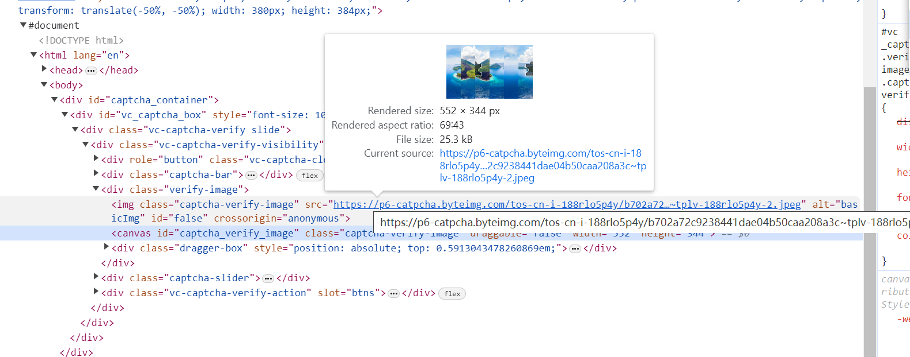

* TypeError: WebDriver.__init__() got an unexpected keyword argument 'executable_path'
  * [TypeError: WebDriver.__init__() got an unexpected keyword argument 'executable_path' in Selenium Python - Stack Overflow](https://stackoverflow.com/questions/76550506/typeerror-webdriver-init-got-an-unexpected-keyword-argument-executable-p)
  * With latest selenium(**v4.6.0 and onwards**), its in-built tool known as SeleniumManger can download and handle the driver.exe if you do not specify. 
  * 也就是说，不需要自己手动下载驱动了，直接用selenium就行了，它会自动下载驱动的。
  * 自己下载, `C:\Users\nisus\.cache\selenium\chromedriver\win64\119.0.6045.105`
  * 环境变量指定了, 则会有限使用环境变量的, 否则会自己下载匹配的.

* The chromedriver version (118.0.5993.70) detected in PATH at D:\App\Scoop\shims\chromedriver.exe might not be compatible with the detected chrome version (119.0.6045.200); currently, chromedriver 119.0.6045.105 is recommended for chrome 119.*, so it is advised to delete the driver in PATH and retry
  * `scoop uninstall chromedriver`
  * 驱动不匹配, 会查找不到元素!!

* 图形验证码
  * 

* 命令行参数
  * `JUEJIN_USERNAME=609069481@qq.com;JUEJIN_PASSWORD=***;JUEJIN_NICKNAME=Nisus`
